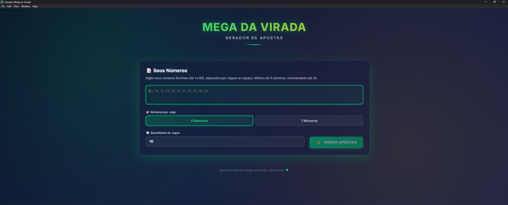

<div align="center">

# 🎰 Gerador Mega da Virada

### Aplicação desktop moderna para gerar combinações inteligentes de apostas

[](LICENSE)
[](https://www.electronjs.org/)
[](#-downloads)



</div>

---

## ✨ Destaques

- 🎯 **Interface Moderna** - Design elegante com tema dark e animações suaves
- 🧮 **Algoritmo Inteligente** - Geração eficiente de combinações matemáticas
- 💾 **Exportação Flexível** - Salve em CSV ou imprima diretamente
- ⚡ **Performance Otimizada** - Gere milhares de combinações em segundos
- 🔒 **100% Offline** - Todos os dados ficam no seu computador

## 📋 Funcionalidades

### 🎲 Geração de Combinações
- Digite seus números favoritos (1 a 60)
- Validação automática em tempo real
- Suporte para vírgula ou espaço como separador
- Cálculo automático do total de combinações possíveis

### 📊 Visualização Clara
- Números formatados em estilo de volante da loteria
- Numeração automática dos jogos
- Interface limpa e intuitiva
- Feedback visual para validações

### 💾 Exportação e Impressão
- **CSV**: Compatível com Excel, Google Sheets e LibreOffice
- **Impressão**: Layout otimizado para papel A4
- Formatação pronta para uso nas casas lotéricas

## 🚀 Downloads

Baixe a versão mais recente para seu sistema operacional:

- 🪟 [**Windows**](../../releases/latest) - `.exe` installer
- 🍎 [**macOS**](../../releases/latest) - `.dmg` package

> **Nota**: Visite a página de [Releases](../../releases) para baixar a versão mais recente.

## 📖 Como Usar

### 1️⃣ Digite seus números
Digite de 6 a 20 números no campo de entrada:
```
Exemplo: 05, 12, 23, 30, 45, 51, 52, 53, 58, 60
```

### 2️⃣ Defina a quantidade
Escolha quantos jogos deseja gerar. O sistema mostra automaticamente o máximo possível:
- 10 números → 210 combinações
- 15 números → 5.005 combinações
- 20 números → 38.760 combinações

### 3️⃣ Gere as apostas
Clique em **"Gerar Apostas"** e visualize os resultados instantaneamente.

### 4️⃣ Exporte ou Imprima
Use os botões de **Exportar CSV** ou **Imprimir** para salvar suas apostas.

## 💻 Desenvolvimento

### Pré-requisitos
- Node.js 18 ou superior
- npm ou yarn

### Instalação Local

```bash
# Clone o repositório
git clone https://github.com/iuriramos93/Gerador_MegaVirada.git

# Entre no diretório
cd Gerador_MegaVirada

# Instale as dependências
npm install
```

### Executar em Desenvolvimento

```bash
# Modo normal
npm start

# Com DevTools aberto
npm run dev
```

### Gerar Build

```bash
# Build para Windows
npm run build -- --win

# Build para macOS
npm run build -- --mac
```

O instalador será gerado na pasta `dist/`.

## 🎯 Regras da Mega da Virada

| Item | Valor |
|------|-------|
| Números válidos | 1 a 60 |
| Números por jogo | 6 |
| Mínimo para entrada | 6 números |
| Máximo recomendado | 20 números |

## 💡 Exemplos de Uso

### 📌 Cenário 1: Poucos números (até 12)
- **Entrada**: 10 números
- **Combinações**: 210
- **Recomendação**: Gerar todas as combinações

### 📌 Cenário 2: Números moderados (13-17)
- **Entrada**: 15 números
- **Combinações**: 5.005
- **Recomendação**: Selecionar entre 50-500 jogos por amostragem

### 📌 Cenário 3: Muitos números (18-20)
- **Entrada**: 20 números
- **Combinações**: 38.760
- **Recomendação**: Selecionar entre 100-1000 jogos por amostragem

## 🛠️ Tecnologias

<table>
  <tr>
    <td align="center"><b>Electron</b><br>v28.0</td>
    <td align="center"><b>Node.js</b><br>v20</td>
    <td align="center"><b>JavaScript</b><br>Vanilla</td>
  </tr>
</table>

- **Frontend**: HTML5, CSS3, JavaScript puro
- **Backend**: Node.js + Electron
- **Build**: electron-builder
- **CI/CD**: GitHub Actions

## 📁 Estrutura do Projeto

```
Gerador_MegaVirada/
├── assets/              # Recursos (ícones, screenshots)
├── .github/
│   └── workflows/       # GitHub Actions para CI/CD
├── main.js             # Processo principal do Electron
├── renderer.js         # Lógica da interface e algoritmo
├── index.html          # Estrutura HTML
├── styles.css          # Estilos CSS modernos
├── package.json        # Configuração e dependências
├── LICENSE             # Licença GPL v3
└── README.md           # Este arquivo
```

## 🧮 Detalhes do Algoritmo

### Cálculo de Combinações
```
C(n, k) = n! / (k! × (n-k)!)
Onde: n = total de números, k = 6 (tamanho do jogo)
```

### Métodos de Geração

**Completa**: Quando o número de combinações é viável (≤ quantidade solicitada)
- Usa algoritmo iterativo com índices
- Garante todas as combinações possíveis

**Amostragem**: Quando há muitas combinações
- Gera jogos aleatórios únicos
- Usa Set para evitar duplicatas
- Mantém distribuição equilibrada

## ⚡ Performance

| Números | Combinações | Tempo Médio |
|---------|-------------|-------------|
| 10 | 210 | < 0.5s |
| 15 | 5.005 | < 1s |
| 20 | 38.760 | < 3s |
| 25 | 177.100 | ~5-8s (amostragem recomendada) |

> Testado em: Intel i5, 8GB RAM, Windows 11

## 🤝 Contribuindo

Contribuições são bem-vindas! Sinta-se à vontade para:

1. Fazer fork do projeto
2. Criar uma branch para sua feature (`git checkout -b feature/MinhaFeature`)
3. Commit suas mudanças (`git commit -m 'Add: Minha nova feature'`)
4. Push para a branch (`git push origin feature/MinhaFeature`)
5. Abrir um Pull Request

## 📝 Licença

Este projeto está sob a licença GPL v3. Veja o arquivo [LICENSE](LICENSE) para mais detalhes.

## ⚠️ Aviso Legal

Este aplicativo é uma ferramenta de organização de apostas e não garante prêmios. A Mega da Virada é um jogo de probabilidade operado pela Caixa Econômica Federal. Jogue com responsabilidade.

---

<div align="center">

### 🍀 Boa Sorte na Mega da Virada! 🍀

Desenvolvido com ❤️ por [Iuri Ramos](https://github.com/iuriramos93)

⭐ Se este projeto foi útil, considere dar uma estrela!

</div>
